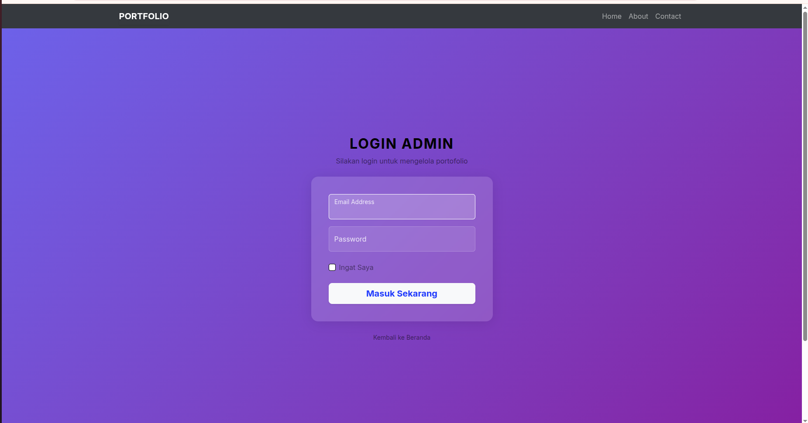
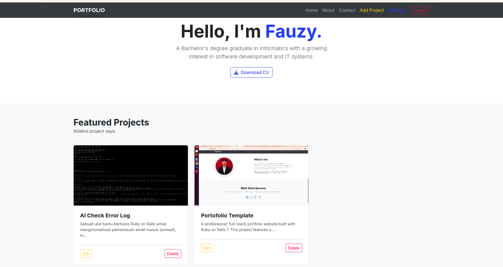
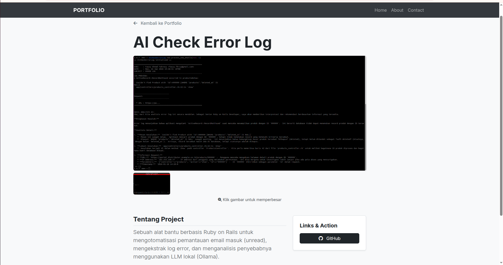
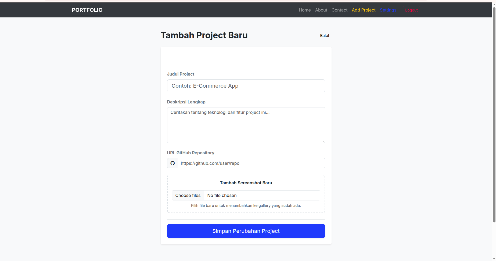
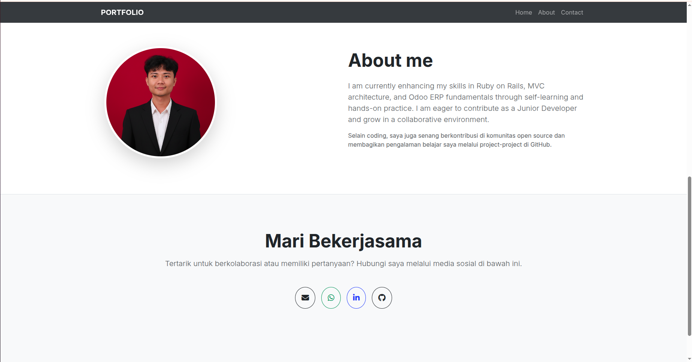
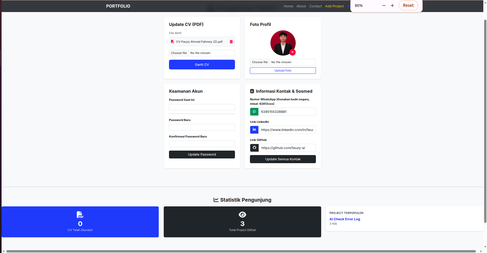

# 🚀 Personal Portfolio & CMS Dashboard

A professional, full-stack portfolio website built with **Ruby on Rails 7**. This project features a secure admin dashboard to manage projects, profile settings, and track visitor interactions in real-time.


## 🌟 Key Features

### 👤 Admin Management (CMS)
* **Secure Authentication:** Powered by Devise (Registration disabled for security).
* **Project Management:** CRUD functionality for portfolio items with multiple image uploads using Active Storage.
* **Dynamic Settings:** Manage your CV, profile photo, social links (WhatsApp, LinkedIn, GitHub), and bio directly from the dashboard.

### 📊 Visitor & Interaction Tracking
* **CV Download Tracking:** Automatically logs every time a visitor downloads your CV.
* **WhatsApp Redirect Tracking:** Counts how many times recruiters click your contact button.
* **Dashboard Stats:** Visual summary of total visitor interactions.

### 🛠️ Technical Highlights
* **Rails 7 & Propshaft:** Using the latest asset pipeline for fast performance.
* **Turbo & Hotwire:** Single-page application feel for the admin dashboard.
* **PostgreSQL:** Production-ready database.
* **Responsive Design:** Styled with Bootstrap 5 and FontAwesome.

---

## 🛠️ Tech Stack

* **Framework:** Ruby on Rails 7
* **Database:** PostgreSQL (Production), SQLite (Development)
* **Storage:** AWS S3 / Cloudinary (Production) or Disk (Local)
* **Frontend:** Bootstrap 5, Turbo, Stimulus JS
* **Authentication:** Devise

---

## Screenshots

* **Login** 

* **Front Page** 

* **Show Project** 

* **Add Project** 

* **About dan Contact**

* **Setting Page**


---

## 🚀 Getting Started (Local Development)

This project includes an automated setup script to ensure all assets and databases are configured correctly.

### 1. Prerequisites
* Ruby 3.x.x
* Rails 7.x.x
* PostgreSQL installed and running

### 2. Installation
Clone the repository:
```bash
git clone https://github.com/fauzy-a/portfolio.git
cd REPO_NAME
Run the automated setup: bin/setup
Accessing Admin Panel
Since registration is disabled, create your admin user via Rails Console:
rails console
# Then run:
User.create!(email: 'admin@example.com', password: 'password', password_confirmation: 'password')
Login at: http://localhost:3000/panel-admin